<!-- Header banner -->

<!-- Typing animation -->

  

 

<!-- Scrolling marquee (assets/marquee.svg) -->

  

---

<h1 align="center">Hi, I'm Shubham Ojha 👋</h1>

<h3 align="center">Computer Science Engineering Student | Backend & AI Enthusiast</h3>

I'm a CSE student currently exploring and building with <b>Web Development, Backend Engineering, and AI/LLM technologies</b>.

I enjoy learning by building projects, solving DSA problems, and experimenting with new technologies.

---

<h2 align="center">🚀 What I'm Working On</h2>

🧠 Data Structures & Algorithms using <b>C++</b> 
🌐 Web Development using <b>HTML, CSS, JavaScript & TypeScript</b> 
⚡ Backend Development using <b>Python & FastAPI</b> 
🤖 Exploring <b>AI / LLM application development</b> 
🗄️ Learning <b>SQL & Database Management</b> 
🔨 Building projects to strengthen my development skills

---

<h2 align="center">🛠️ Tech Stack</h2>

<h3 align="center">Languages</h3>

  

<h3 align="center">Frameworks & Technologies</h3>

  

<h3 align="center">Tools</h3>

  

---

<h2 align="center">📌 Featured Repositories</h2>

<h3 align="center">🧠 DSA</h3>

My Data Structures & Algorithms practice using C++.

<h3 align="center">⚡ Backend</h3>

Python backend development and FastAPI learning.

<h3 align="center">🌐 Web Development</h3>

Web development practice covering HTML, CSS, JavaScript and TypeScript.

<h3 align="center">🚀 JanSahay</h3>

An AI-driven scheme matching platform built for the Smart India Hackathon.

<h3 align="center">💻 Portfolio</h3>

My personal developer portfolio and experiments with modern web technologies.

---

<h2 align="center">📊 GitHub Stats</h2>

  
  

  

<!-- Contribution snake -->

  

---

<h2 align="center">🤝 Connect With Me</h2>

  
  
  
  

---

Thanks for visiting 

