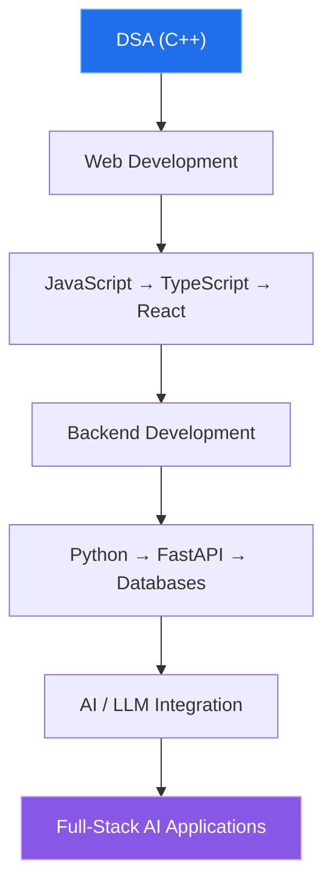

<!-- Header banner -->


<!-- Typing animation -->
<div align="center">
  <a href="https://git.io/typing-svg">
    
  </a>
</div>

<br/>

<!-- Scrolling marquee (assets/marquee.svg) -->
<div align="center">
  
</div>

---

# Hi, I'm Shubham Ojha 👋

### Computer Science Engineering Student | Backend & AI Enthusiast

I'm a CSE student currently exploring and building with **Web Development, Backend Engineering, and AI/LLM technologies**.

I enjoy learning by building projects, solving DSA problems, and experimenting with new technologies.

---

## 🧑‍💻 `developer.json`

```json
{
  "name": "Shubham Ojha",
  "role": "Computer Science Engineering Student",
  "focus": ["Web Development", "Backend Engineering", "AI / LLM"],
  "languages": ["C++", "Python", "Java", "JavaScript", "TypeScript"],
  "currentlyLearning": ["DSA", "FastAPI", "SQL", "AI / LLM Integration"],
  "learningStyle": "Learn by building projects",
  "status": "Building. Learning. Repeating. 🔁"
}
```

---

## 🚀 What I'm Working On

- 🧠 Data Structures & Algorithms using **C++**
- 🌐 Web Development using **HTML, CSS, JavaScript & TypeScript**
- ⚡ Backend Development using **Python & FastAPI**
- 🤖 Exploring **AI / LLM application development**
- 🗄️ Learning **SQL & Database Management**
- 🔨 Building projects to strengthen my development skills

---

## 🛠️ Tech Stack

### Languages
<p>
  
</p>

### Frameworks & Technologies
<p>
  
</p>

### Tools
<p>
  
</p>

---

## 📌 Featured Repositories

### 🧠 DSA
My Data Structures & Algorithms practice using C++.

### ⚡ Backend
Python backend development and FastAPI learning.

### 🌐 Web Development
Web development practice covering HTML, CSS, JavaScript and TypeScript.

### 🚀 JanSahay
An AI-driven scheme matching platform built for the Smart India Hackathon.

### 💻 Portfolio
My personal developer portfolio and experiments with modern web technologies.

---

## 📈 Current Learning Path



---

## 📊 GitHub Stats

<div align="center">
  
  
</div>

<div align="center">
  
</div>

<!-- Contribution snake -->
<div align="center">
  
</div>

---

<div align="center">Thanks for visiting 🚀</div>
